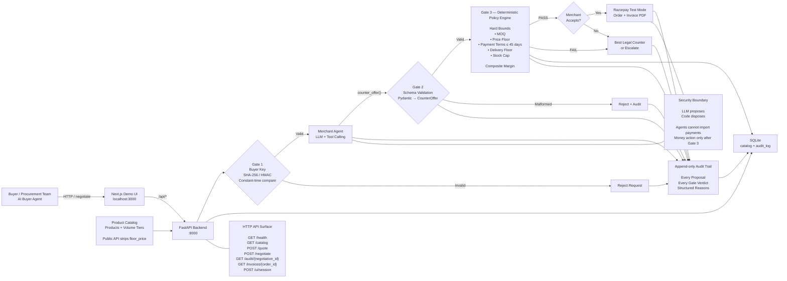
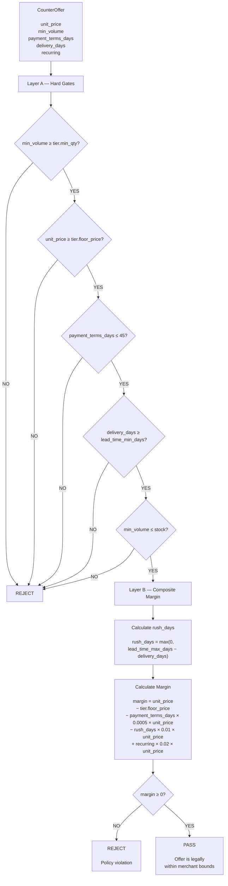

# CatalogAgent

## Overview

CatalogAgent is a B2B agentic-procurement negotiation system built for the
Razorpay AI Buildathon (Track 01 — AI Growth & Agentic Commerce).

An AI buyer agent (acting for a procurement team) queries a merchant's
agent-readable product catalog, then negotiates a multi-variable supply
contract — unit price, volume/MOQ, payment terms, delivery lead time, and
recurring commitment — with an AI merchant agent.

The differentiator is bounded autonomy: every merchant agent move is checked
by a deterministic policy engine before it can reach Razorpay. The merchant
LLM reasons over the five negotiable variables — it can hold price and win on
commitment, terms, or volume instead — but it never gets to move money on its
own. Every proposal and every guardrail verdict is written to an append-only
audit trail. That's the moat, not the LLM, which is the smallest and least
defensible part of the system.

**The bar (verbatim from the track):** *Every money action explainable, bounded
and gated. Show the audit trail and one failure handled gracefully.*

## Architecture




Three gates: identity (hashed buyer API key, constant-time compare), schema
(Pydantic validates the LLM's structured tool call — malformed calls are
audited and rejected), and action permission (the deterministic policy engine
enforces merchant bounds). The money action is reachable only after Gate 3
passes and the merchant accepts. No agent module imports `payments`.


### HTTP surface


| Method | Path                      | Auth                                              |
| ------ | ------------------------- | ------------------------------------------------- |
| `GET`  | `/health`                 | public                                            |
| `GET`  | `/catalog`                | public (floors stripped)                          |
| `POST` | `/quote`                  | `X-Buyer-Key`                                     |
| `POST` | `/negotiate`              | key + negotiation ownership                       |
| `GET`  | `/audit/{negotiation_id}` | key + ownership                                   |
| `GET`  | `/invoices/{order_id}`    | key + ownership (PDF)                             |
| `POST` | `/ui/session`             | public demo helper (provisions a throwaway buyer) |


## Policy Engine

The deterministic policy engine is Gate 3 and the core moat. It makes **zero**
**LLM calls** — `app/policy.py` takes a structured `CounterOffer`, applies hard
bounds, then computes a composite margin and passes/fails the offer. Every
verdict reason is a structured Python string (never LLM text) so the audit
trail stays reproducible. Source of truth for the formulas below:
[backend/app/policy.py](backend/app/policy.py).




### Constants


| Constant                 | Symbol     | Value                | Meaning                                                             |
| ------------------------ | ---------- | -------------------- | ------------------------------------------------------------------- |
| `TERMS_COST_PER_DAY`     | terms cost | `0.0005` / day       | working-capital cost of granting credit (0.05%/day)                 |
| `RUSH_COST_PER_DAY`      | rush cost  | `0.01` / day         | margin given up per day delivery beats the standard max lead time   |
| `RECURRING_CONCESSION`   | recurring  | `+0.02` × unit_price | concession granted for a recurring commitment (predictable revenue) |
| `MAX_PAYMENT_TERMS_DAYS` | max terms  | `45` days            | hard cap on payment terms                                           |


### Layer A — Hard gates (fail any one → reject)

1. **Minimum order quantity:** `min_volume >= tier.min_qty` (else an adversarial buyer can't claim a tiny volume to reach the most lenient tier).
2. **Price floor:** `unit_price >= tier.floor_price`.
3. **Payment terms:** `payment_terms_days <= 45`.
4. **Delivery floor:** `delivery_days >= lead_time_min_days`.
5. **Volume cap:** `min_volume <= stock`.


### Layer B — Composite margin (reject if `< 0`)

```
margin = unit_price
       - tier.floor_price
       - payment_terms_days * 0.0005 * unit_price
       - rush_days * 0.01 * unit_price
       + recurring * 0.02 * unit_price

where rush_days = max(0, lead_time_max_days - delivery_days)
      (only when delivery_days < lead_time_max_days)
```

A price at or above the floor can still fail when terms + rush + recurring push
effective margin negative. Recurring is the one concession that *helps* a tight
package pass.

### Worked example — `elec-conn-001`

`elec-conn-001` tiers (seed data): 1000+ floor `11.20`, `lead_time_min_days=7`,
`lead_time_max_days=21`, `stock=20000`.

**Case 1 — floor-price offer at net-30, standard delivery (FAILS):**

- `unit_price = 11.20` (= floor), `min_volume=1000`, `payment_terms_days=30`, `delivery_days=21` (= max, so `rush_days=0`), `recurring=False`.
- `margin = 11.20 - 11.20 - (30 * 0.0005 * 11.20) - 0 + 0`
- `= 0 - 0.168 = -0.168` → **negative → REJECT.** The 30-day terms cost alone eats the entire margin even at the floor.

**Case 2 — raise price above floor (PASSES):**

- `unit_price = 11.40` (next tier list price), same terms/delivery, `rush_days=0`, `recurring=False`.
- `margin = 11.40 - 11.20 - (30 * 0.0005 * 11.40) = 0.20 - 0.171 = +0.029` → **PASSES** (≈0.25% margin).

**Case 3 — net-0 instead of net-30 (PASSES):**

- `unit_price = 11.20`, `payment_terms_days=0` → `terms_cost = 0`.
- `margin = 11.20 - 11.20 - 0 = 0` → not `< 0` → **PASSES** (zero margin, but legal).

Net: at the floor price, the buyer must either pay immediately (net-0) or accept
a slightly higher unit price to absorb the working-capital cost of net-30.

## Security

- LLM proposes, code disposes. The guardrail is a control-flow property, not
a convention the LLM is "supposed" to respect.
- Buyer keys are stored as SHA-256 (+ optional HMAC pepper), never plaintext.
- Public `/catalog` exposes list prices and tiers but strips `floor_price`, so
buyers have to probe for it.
- Verdict reasons are machine-generated (structured Python strings), never
LLM text — the audit trail stays reproducible.
- Honestly out of scope (documented, not faked): agent-identity verification
(AP2), dynamic token issuance, rate limiting, cryptographic audit
immutability.


## Quickstart

Requires Python 3.11+. Secrets live in `backend/.env` (never committed; copy
from `.env.example`). Run from `backend/` unless noted.

```bash
# 1. install + env
cd backend
python -m venv .venv
# Windows:
.venv\Scripts\pip install -e .
copy .env.example .env   # then fill RAZORPAY_*, LLM_*, optional KEY_PEPPER

# 2. start the API (auto-seeds catalog on startup)
.venv\Scripts\python.exe -m uvicorn app.main:app --port 8000

# 3. public catalog
curl -s http://127.0.0.1:8000/catalog
```

Expected: JSON with ~10 products; each volume tier exposes only `min_qty` and
`unit_price` (`floor_price` is stripped).

Optional buyer key for write paths:

```bash
.venv\Scripts\python.exe -m app.create_buyer acme --budget 50000
# prints bk_... once — use as X-Buyer-Key
```


### Demo UI (Next.js)

```bash
# terminal A — backend on :8000 (as above)
# terminal B
cd frontend
npm install
npm run dev
```

Open [http://localhost:3000](http://localhost:3000). The Next dev server
proxies `/api/*` to `:8000` (see `frontend/next.config.mjs`). Details in
[frontend/README.md](frontend/README.md).

A minimal single-file UI is also served at `GET /` from
`backend/static/index.html`.

### Multi-turn demo harness

With the API configured (LLM + optional Razorpay):

```bash
cd backend
.venv\Scripts\python.exe -m demo.run_demo
```

Runs reasonable / aggressive / creative buyer scenarios over HTTP and prints
audit tables.

## Audit trail

```bash
curl -s http://127.0.0.1:8000/audit/<negotiation_id> \
  -H "X-Buyer-Key: bk_..."
```

Returns ordered `trail` JSON plus a readable table under `text`. Or open
`backend/catalogagent.db` in DB Browser for SQLite and look at `audit_log`.

## Testing

```bash
cd backend
.venv\Scripts\python.exe -m pytest tests/ -q
```


## Layout

```
backend/app/          FastAPI routes, policy, db, payments, invoicing, llm_client
backend/app/agents/   merchant.py + buyer.py (isolated; no payments imports)
backend/demo/         run_demo + smoke/repro scripts
backend/tests/        pytest suite
frontend/             Next.js negotiation UI
context/architecture/ design + phase notes
context/security/     security model
```

